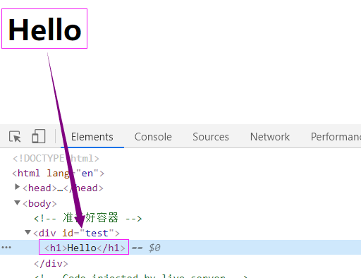
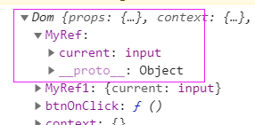
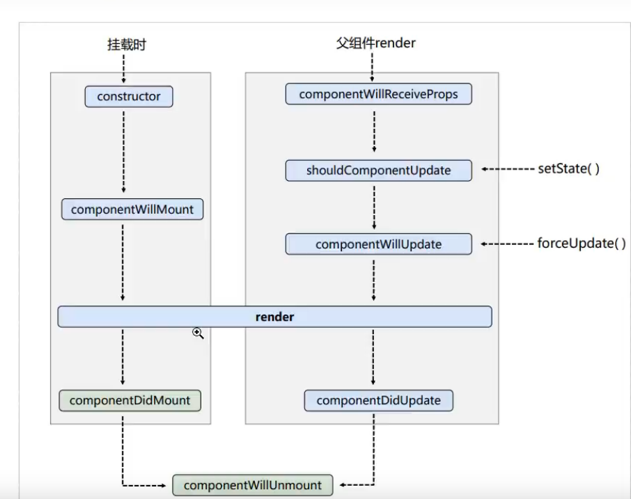

# React简介

**react是什么？**

React用于构建用户界面的JS库。是一个将数据渲染为HTML视图的开源JS库。

**为什么学？**

1.原生JS操作DOM繁琐，效率低

2.使用JS直接操作DOM,浏览器会进行大量的重绘重排

3.原生JS没有组件化编码方案，代码复用低

> 在学习之前最好看一下关于npm的知识：下面是我在网上看见的一个写的还不错的npm的文章
>
> [npm](https://blog.csdn.net/qq_25502269/article/details/79346545)

# React入门

## React 基础案例

1.先倒入三个包：

【先引入react.development.js，后引入react-dom.development.js】

``` cmd
react.development.js
react-dom.development.js
babel.min.js 
```

2.创建一个容器

3.创建虚拟DOM，渲染到容器中

``` html
<body>
    <!-- 准备好容器 -->
    <div id="test">

    </div>
</body>
<!-- 引入依赖 ,引入的时候，必须就按照这个步骤-->
<script src="../js/react.development.js" type="text/javascript"></script>
<script src="../js/react-dom.development.js" type="text/javascript"></script>

<script src="../js/babel.min.js" type="text/javascript"></script>

<!--这里使用了babel用来解析jsx语法-->
<script type="text/babel">
        // 1.创建虚拟DOM
        const VDOM = <h1>Hello</h1>  //这个地方使用的是JSX语法，不需要加""
        // 2.渲染，如果有多个渲染同一个容器，后面的会将前面的覆盖掉
        ReactDOM.render(VDOM,document.getElementById("test"));        
</script>
</html>
```

这样，就会在页面中的这个div容器上添加这个h1.



## JSX基础语法

1.定义虚拟DOM，不能使用“”

2.标签中混入JS表达式的时候使用{}

3.样式的类名指定不要使用class，使用className

4.内敛样式要使用双大括号包裹

5.不能有多个根标签，只能有一个跟标签

6.标签必须闭合

7.如果小写字母开头，就将标签转化为html同名元素，如果html中无该标签对应的元素，就报错；如果是大写字母开头，react就去渲染对应的组件，如果没有就报错

> 关于JS表达式和JS语句：
>
>   JS表达式：返回一个值，可以放在任何一个需要值的地方  a  a+b  demo(a)  arr.map() function text(){}
>   JS语句：if(){} for(){} while(){} swith(){} 不会返回一个值

实例如下：

```html
<!DOCTYPE html>
<html lang="en">
<head>
    <meta charset="UTF-8">
    <meta name="viewport" content="width=device-width, initial-scale=1.0">
    <title>Document</title>
    <style>
        .sss{
            color: red;
        }
    </style>
</head>
<body>
    <!-- 准备好容器 -->
    <div id="test">
        
    </div>
</body>
<!-- 引入依赖 ,引入的时候，必须就按照这个步骤-->
<script src="../js/react.development.js" type="text/javascript"></script>
<script src="../js/react-dom.development.js" type="text/javascript"></script>

<script src="../js/babel.min.js"></script>
<!--这里使用了js来创建虚拟DOM-->
<script type="text/babel">
        const MyId = "title";
        const MyData = "Cyk";
        // 1.创建虚拟DOM
        const VDOM = (
            <h1 id = {MyId.toLocaleUpperCase()}>
                <span className = "sss" style = {{fontSize:'50px'}}>sss</span>
            </h1>
        )
        // 2.渲染，如果有多个渲染同一个容器，后面的会将前面的覆盖掉
        ReactDOM.render(VDOM,document.getElementById("test"));
</script>

</html>
```

## 两种创建虚拟DOM的方式

**1.使用JSX创建虚拟DOM**

```jsx
 const VDOM = (
            <h1 id = {MyId.toLocaleUpperCase()}>
                <span className = "sss" style = {{fontSize:'50px'}}>sss</span>
            </h1>
        )
```

这个在上面的案例中已经演示过了 ，下面看看另外一种创建虚拟DOM的方式

**2.使用JS创建虚拟DOM**

```js
// 1.创建虚拟DOM[在这使用了js的语法]React.createElement(标签,标签属性,内容)
const VDOM = React.createElement('h1',{id:"title"},"nihao")
```

使用JS和JSX都可以创建虚拟DOM，但是可以看出JS创建虚拟DOM比较繁琐，尤其是标签如果很多的情况下，所以还是比较推荐使用JSX来创建。

# 组件

当应用是以多组件的方式实现，这个应用就是一个组件化的应用

> **注意：** 组件名称必须以大写字母开头。
>
> React 会将以小写字母开头的组件视为原生 DOM 标签。例如，< div />` 代表 HTML 的 div 标签，而 `< Weclome /> 则代表一个组件，并且需在作用域内使用 `Welcome`
>
> 传递的参数，不能在组件中改动

## 函数式组件

```react
//1.先创建函数，函数可以有参数，也可以没有，但是必须要有返回值 返回一个虚拟DOM
function Welcome(props) {
  return <h1>Hello, {props.name}</h1>;
}
//2.进行渲染
ReactDOM.Render(<Welcom name = "ss" />,document.getElementById("div"));
```


让我们来回顾一下这个例子中发生了什么：

1. 我们调用 `ReactDOM.render()` 函数，并传入 ` <Welcome name="Sara" /> ` 作为参数。
2. React 调用 `Welcome` 组件，并将 `{name: 'Sara'}` 作为 props 传入。
3. `Welcome` 组件将 `Hello, Sara` 元素作为返回值。
4. React DOM 将 DOM 高效地更新为 `Hello, Sara`。

## Class组件

```react
//必须继承React.Component
//然后重写Render()方法，该方法一定要有返回值，返回一个虚拟DOM
class Welcome extends React.Component {
  render() {
    return <h1>Hello, {this.props.name}</h1>;
  }
}
//渲染 【这个跟之前也是一样的】
ReactDOM.Render(<Welcom name = "ss" />,document.getElementById("div"));
```

执行过程：

​    1.React解析组件标签，找到相应的组件

​    2.发现组件是类定义的，随后new出来的类的实例，并通过该实例调用到原型上的render方法

​    3.将render返回的虚拟DOM转化为真实的DOM,随后呈现在页面中

## 组件案例

下面，我们通过一个案例更好的理解组件：【只关注与核心代码】

我们发现组件是可以包含中使用的， 而且如果创建的数组，必须要代一个key。数组元素中使用的 key 在其兄弟节点之间应该是独一无二的。然而，它们不需要是全局唯一的。当我们生成两个不同的数组时，我们可以使用相同的 key 值 

```react
<script type="text/babel">

        //创建一个组件<li>
        function GetLi(props){      
            return <li>{props.value}</li>
        };

        // 1.创建类式组件<ul>
        class MyComponent extends React.Component{
            render(){
                console.log(this.props.arr);
                let com = this.props.arr.map((item,index)=>
                     //在这个地方包含了GetLi这个组件，【注意不能用{}】
                     //因为这个是一个列表，所以必须传递一个key【独一无二的Key】
                     //key 帮助 React 识别哪些元素改变了，比如被添加或删除。
                        <GetLi value={item} key = {index} />
                    );
                console.log(com);
                return <ul>{com}</ul>
            }
        }
        
        let num = [1,2,3,4]
        //2.渲染组件
        ReactDOM.render(<MyComponent  arr={num}/>,document.getElementById("test");
</script>

```


# 组件实例的三大属性

## state

我们都说React是一个状态机，体现是什么地方呢，就是体现在state上，通过与用户的交互，实现不同的状态，然后去渲染UI,这样就让用户的数据和界面保持一致了。state是组件的私有属性。

在React中，更新组件的state，结果就会重新渲染用户界面(不需要操作DOM),一句话就是说，用户的界面会随着状态的改变而改变。

state是组件对象最重要的属性，值是对象（可以包含多个key-value的组合）

**案例**：

1.需求：页面显示【今天天气很炎热】，鼠标点击文字的时候，页面更改为【今天天气很凉爽】

核心代码如下：

```react
<body>
    <!-- 准备好容器 -->
    <div id="test">
        
    </div>
</body>
<!-- 引入依赖 ,引入的时候，必须就按照这个步骤-->
<script src="../js/react.development.js" type="text/javascript"></script>
<script src="../js/react-dom.development.js" type="text/javascript"></script>

<script src="../js/babel.min.js"></script>
<!--这里使用了js来创建虚拟DOM-->
<script type="text/babel">
        //1.创建组件
        class St extends React.Component{
            constructor(props){
                super(props);
                //先给state赋值
                this.state = {isHot:true,win:"ss"};
                //找到原型的dem，根据dem函数创建了一个dem1的函数，并且将实例对象的this赋值过去
                this.dem1 = this.dem.bind(this);
            }
            //render会调用1+n次【1就是初始化的时候调用的，n就是每一次修改state的时候调用的】
            render(){ //这个This也是实例对象
                //如果加dem()，就是将函数的回调值放入这个地方
                //this.dem这里面加入this，并不是调用，只不过是找到了dem这个函数，在调用的时候相当于直接调用，并不是实例对象的调用
                return <h1 onClick = {this.dem1}>今天天气很{this.state.isHot?"炎热":"凉爽"}</h1>    
            }
            //通过state的实例调用dem的时候，this就是实例对象
            dem(){
                const state =  this.state.isHot;
                 //状态中的属性不能直接进行更改，需要借助API
                // this.state.isHot = !isHot; 错误
                //必须使用setState对其进行修改，并且这是一个合并
                this.setState({isHot:!state});
            }
        }
        // 2.渲染，如果有多个渲染同一个容器，后面的会将前面的覆盖掉
        ReactDOM.render(<St />,document.getElementById("test"));
</script>
```

需要注意的是：

1.组件的构造函数，必须要传递一个props参数

2.特别关注this【重点】，类中所有的方法局部都开启了严格模式，如果直接进行调用，this就是undefined

3.想要改变state,需要使用setState进行修改，如果只是修改state的部分属性，则不会影响其他的属性，这个只是合并并不是覆盖。

this.setState()，该方法接收两种参数：对象或函数。

1. 对象：即想要修改的state
2. 函数：接收两个函数，第一个函数接受两个参数，第一个是当前state，第二个是当前props，该函数返回一个对象，和直接传递对象参数是一样的，就是要修改的state；第二个函数参数是state改变后触发的回调

在此还需要注意的是，setState有异步更新和同步更新两种形式，那么什么时候会同步更新，什么时候会异步更新呢？

**React控制之外的事件中调用setState是同步更新的。比如原生js绑定的事件，setTimeout/setInterval等**。

**大部分开发中用到的都是React封装的事件，比如onChange、onClick、onTouchMove等，这些事件处理程序中的setState都是异步处理的。**

```react
//1.创建组件
class St extends React.Component{
    //可以直接对其进行赋值
    state = {isHot:10};
    render(){ //这个This也是实例对象
        return <h1 onClick = {this.dem}>点击事件</h1> 
    }
//箭头函数 [自定义方法--->要用赋值语句的形式+箭头函数]
    dem = () =>{
        //修改isHot
        this.setState({ isHot: this.state.isHot + 1})
        console.log(this.state.isHot);
    }
}
```

上面的案例中预期setState使得isHot变成了11，输出也应该是11。然而在控制台打印的却是10，也就是并没有对其进行更新。这是因为异步的进行了处理，在输出的时候还没有对其进行处理。

```react
componentDidMount(){
    document.getElementById("test").addEventListener("click",()=>{
        this.setState({isHot: this.state.isHot + 1});
        console.log(this.state.isHot);
    })
}
```

但是通过这个原生JS的，可以发现，控制台打印的就是11，也就是已经对其进行了处理。也就是进行了同步的更新。

**React怎么调用同步或者异步的呢？**

在 React 的 setState 函数实现中，会根据一个变量 isBatchingUpdates 判断是直接更新 this.state 还是放到队列中延时更新，而 isBatchingUpdates 默认是 false，表示 setState 会同步更新 this.state；但是，有一个函数 batchedUpdates，该函数会把 isBatchingUpdates 修改为 true，而当 React 在调用事件处理函数之前就会先调用这个 batchedUpdates将isBatchingUpdates修改为true，这样由 React 控制的事件处理过程 setState 不会同步更新 this.state。

**如果是同步更新，每一个setState对调用一个render，并且如果多次调用setState会以最后调用的为准，前面的将会作废；如果是异步更新，多个setSate会统一调用一次render**

```react
dem = () =>{
    this.setState({
        isHot:  1,
        cont:444
    })
    this.setState({
    	isHot: this.state.isHot + 1

    })
    this.setState({
        isHot:  888,
        cont:888
    })
}
```

上面的最后会输出：isHot是888，cont是888

```react
 dem = () =>{
                
                this.setState({
                    isHot: this.state.isHot + 1,
                    
                })
                this.setState({
                    isHot: this.state.isHot + 1,
                    
                })
                this.setState({
                    isHot: this.state.isHot + 888
                })
            }
```

初始isHot为10，最后isHot输出为898，也就是前面两个都没有执行。

**注意！！这是异步更新才有的，如果同步更新，每一次都会调用render，这样每一次更新都会 **

**简化版本：**

1.state的赋值可以不再构造函数中进行

2.使用了箭头函数，将this进行了改变

```react
<body>
    <!-- 准备好容器 -->
    <div id="test">
        
    </div>
</body>
<!-- 引入依赖 ,引入的时候，必须就按照这个步骤-->
<script src="../js/react.development.js" type="text/javascript"></script>
<script src="../js/react-dom.development.js" type="text/javascript"></script>

<script src="../js/babel.min.js"></script>
<script type="text/babel">
        class St extends React.Component{
            //可以直接对其进行赋值
            state = {isHot:true};
            render(){ //这个This也是实例对象
                return <h1 onClick = {this.dem}>今天天气很{this.state.isHot?"炎热":"凉爽"}</h1>    
                //或者使用{()=>this.dem()也是可以的}
            }
            //箭头函数 [自定义方法--->要用赋值语句的形式+箭头函数]
            dem = () =>{
                console.log(this);
                const state =  this.state.isHot;
                this.setState({isHot:!state});
            }
        }
        ReactDOM.render(<St />,document.getElementById("test"));       
</script>
```

如果想要在调用方法的时候传递参数，有两个方法：

```react
<button onClick={(e) => this.deleteRow(id, e)}>Delete Row</button>
<button onClick={this.deleteRow.bind(this, id)}>Delete Row</button>
```

上述两种方式是等价的，分别通过[箭头函数](https://developer.mozilla.org/en-US/docs/Web/JavaScript/Reference/Functions/Arrow_functions)和 [`Function.prototype.bind`](https://developer.mozilla.org/en-US/docs/Web/JavaScript/Reference/Global_objects/Function/bind) 来实现。

在这两种情况下，React 的事件对象 `e` 会被作为第二个参数传递。如果通过箭头函数的方式，事件对象必须显式的进行传递，而通过 `bind` 的方式，事件对象以及更多的参数将会被隐式的进行传递。

## Props

Props主要用来传递数据，比如组件之间进行传值

基本使用：

```react
<body>
    <div id = "div">

    </div>

</body>
<script type="text/babel">
    class Person extends React.Component{
        render(){
            return (
                <ul>
                    //接受数据并显示
                    <li>{this.props.name}</li>
                    <li>{this.props.age}</li>
                    <li>{this.props.sex}</li>
                </ul>
            )
        }
    }
    //传递数据
    ReactDOM.render(<Person name="tom" age = "41" sex="男"/>,document.getElementById("div"));
</script>
```

如果传递的数据是一个对象，可以更加简便的使用

```react
<script type="text/babel">
    class Person extends React.Component{
        render(){
            return (
                <ul>
                    <li>{this.props.name}</li>
                    <li>{this.props.age}</li>
                    <li>{this.props.sex}</li>
                </ul>
            )
        }
    }
    const p = {name:"张三",age:"18",sex:"女"}
   ReactDOM.render(<Person {...p}/>,document.getElementById("div"));
</script>
```

... 这个符号恐怕都不陌生，这个是一个展开运算符，主要用来展开数组，如下面这个例子：

```js
arr = [1,2,3];
arr1 = [4,5,6];
arr2 = [...arr,...arr1];  //arr2 = [1,2,,3,4,5,6]
```

但是他还有其他的用法：

1.复制一个对象给另一个对象{...对象名}。此时这两个对象并没有什么联系了

```js
const p1 = {name:"张三",age:"18",sex:"女"}
const p2 = {...p1};
p1.name = "sss";
console.log(p2)  //{name:"张三",age:"18",sex:"女"}
```

2.在复制的时候，合并其中的属性

```js
 const p1 = {name:"张三",age:"18",sex:"女"}
 const p2 = {...p1,name : "111",hua:"ss"};
 p1.name = "sss";
 console.log(p2)  //{name: "111", age: "18", sex: "女",hua:"ss"}
```

**注意！！** **{...P}并不能展开一个对象**

**props传递一个对象，是因为babel+react使得{..p}可以展开对象，但是只有在标签中才能使用**

**对于props限制**

很多时候都想要传递的参数进行相应的限制，比如：限制传递参数的类型，参数的默认值等等

react对此提供了相应的解决方法：

- propTypes:类型检查，还可以限制不能为空
- defaultProps：默认值

```react
<script type="text/babel">

    
    class Person extends React.Component{
        render(){
            //props是只读的
            return (
                <ul>
                    <li>{this.props.name}</li>
                    <li>{this.props.age}</li>
                    <li>{this.props.sex}</li>
                </ul>
            )
        }
        //对组件的属性对其进行限制
        static propTypes = {
            name:PropTypes.string.isRequired, //限定name是string类型，并且必须要传递
            sex:PropTypes.string,  //限定sex是string类型
            speak:PropTypes.func   //限定speak是function类型
        }
        //指定默认的标签属性
        static defaultProps = {
            sex:"不男不女",
            age:18
        }   
        
    }
    //在js中可以使用{...p}来复制一个对象，但是这个地方并不是复制对象，而是babel+react通过展开运算符，展开了一个对象
    //但是只能在标签中进行使用
    //const p = {name:"张三",age:"18",sex:"女"}   {14}就代表的是数值
    //ReactDOM.render(<Person {...p}/>,document.getElementById("div"));
    ReactDOM.render(<Person name="sss" age = {14} speak="8"/>,document.getElementById("div"));
    

    function speak(){
        console.log("这个是一个函数")
    }

</script>
</html>

```

**函数式组件的使用**：

函数在使用props的时候，是作为参数进行使用的(props)；

```react
function Person(props){
          return (
                <ul>
                    <li>{props.name}</li>
                    <li>{props.age}</li>
                    <li>{props.sex}</li>
                </ul>
            )
    }
```

## Refs

 Refs 提供了一种方式，允许我们访问 DOM 节点或在 render 方法中创建的 React 元素。 

Refs主要提供了三种方式：

**1.字符串形式**

在想要获取到一个DOM节点，可以直接在这个节点上添加ref属性。利用该属性进行获取该节点的值。

案例：给需要的节点添加ref属性，此时该实例对象的refs上就会有这个值。就可以利用实例对象的refs获取已经添加节点的值

```react
<input ref="dian" type="text" placeholder="点击弹出" />

 inputBlur = () =>{
            alert(this.refs.shiqu.value);
        }
```

**2.回调形式**

回调形式会在ref属性中添加一个回调函数。将该DOM作为参数传递过去。

如：ref里面就是一个回调函数，self就是该input标签。然后在将该DOM元素赋值给实例对象中的一个属性

```react
<input ref={self =>{ this.dian = self;console.log(self)}}  placeholder="点击弹出" />
```


也可以将函数提取出来，在ref中进行调用

```react
isRef = (self) =>{
            this.dian = self;
            console.log(self)
        }

<input ref={this.isRef} type="text" placeholder="点击弹出" />
```

**3.API形式**

React其实已经给我们提供了一个相应的API，他会自动的将该DOM元素放入实例对象中

如下：依旧先在DOM元素中添加一个ref元素

```react
{/*<input ref={this.容器名称} type="text" placeholder="点击弹出" />*/}
<input ref={this.MyRef} type="text" placeholder="点击弹出" />
<input ref={this.MyRef1} type="text" placeholder="点击弹出" />
```

通过API，创建React的容器，相当于省略了回调的中间环节。但是这个容器是专门专用的，所以每一个ref都需要创建这个。该API会将DOM元素赋值给实例对象的名称为容器名称的属性的current【这个current是固定的】

```react
{/*容器名称 = React.createRef()*/}
MyRef = React.createRef();
MyRef1 = React.createRef();
```



然后就可以使用了

```react
btnOnClick = () =>{
    //创建之后，将自身节点，传入current中
    console.log(this.MyRef.current.value);
}
```

**官方提示我们不要过度的使用ref，如果发生时间的元素刚好是需要操作的元素，就可以使用事件去替代。**

# React事件

React的事件是通过onXxx属性指定时间处理函数

​        React使用的都是自定义的时间，而不是原生的事件

​        React中的事件是通过事件委托方式处理的

​      通过event.target得到发生事件的Dom元素对象

比如：

先声明一个事件，然后在根据事件创建相应的函数，根据事件的event参数，将DOM元素获取到。

```react
<input onChange={this.saveName} type = "text" name ="username"/>

saveName = (event) =>{
            this.setState({name:event.target.value});
        }
```

**受控和非受控组件**

简单来说：

页面中所有的输入数据都是现用现取的，或者说组件的状态不受React控制的组件 就是非受控的组件

受控制组件，组件的状态受React控制的组件，就是使用事件和statem,输入类的组件，就是将内容绑定到state中的，在使用的时候使用state里面的  





